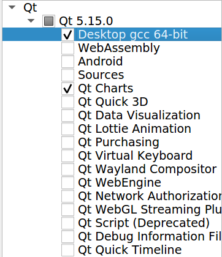

.. _install:

.. 
  for line break without identation ( | symbol put a identation)
.. role:: raw-html(raw)
    :format: html

Installation
============

ROS End-Effector is a ROS package tested on ROS kinetic with Ubuntu 16.04.
:raw-html:` `
So, first, be sure to have ROS kinetic installed as described `here <http://wiki.ros.org/kinetic/Installation/Ubuntu>`_.

.. note::
  We are going to use the abreviation ROSEE for the ROS End-Effector from now on

Basic & Fast Installation 
###############################

The following steps will guide you to install all packages of ROSEE using a *.rosintall* file.
:raw-html:` `
The file will make you clone the necessary repository from their *master* branches.

Run in the terminal:

.. code-block:: bash

  git clone -b devel https://github.com/ADVRHumanoids/ROSEndEffectorPackageManager.git
  cd ROSEndEffectorPackageManager
  ./setup.sh
  cd src
  catkin_init_workspace
  rosws update
  cd ..
  catkin_make -DBUILD_WITH_XBOT2=OFF
  
.. note::
   The sh script will install external necessary dependencies with apt-get
   :raw-html:` `

.. note::
  In future, if you want to pull the last updates, you can use :code:`rosws update` to pull all the updates of each repository with this unique command!
  
.. note::
  Among the ROSEE packages, there are two forks to support non linear mimic joints. Check
  :ref:`End-Effector and their coupled joints <mimicJoint>` for more info.

You are now ready to use ROS End-Effector! Check :ref:`How to use ROS End-Effector with your end-effector <usage>` and :ref:`Examples with ready to use end-effectors <examples>` sections to learn how to use it. 

.. _xbot2Install:

XBot2 Integration
*******************

ROS End-Effector also supports XBot2 to implement the Hardware Abstraction Layer, to communicate with the real or simulated robot. Please dowload it `here <https://github.com/ADVRHumanoids/XBotControl/releases/tag/2.0-devel-core-updated>`_. Be sure to download a >2 version!. Some helps on how setup xbot2 are available `here <https://github.com/ADVRHumanoids/xbot2_examples>`_.

ROS End-Effector include an integrated XBot2Hal: to compile it please set the BUILD_WITH_XBOT2 variable:

.. code-block:: bash

  catkin_make -DBUILD_WITH_XBOT2=ON
  
Logging with MatLogger2
************************
You can use the MatLogger2 tool to log data of your end-effector. This is an optional feature, if you do not want it, nothing else to do is required. 
If you want it, you can install MatLogger2, following `here <https://github.com/ADVRHumanoids/MatLogger2>`_.
:raw-html:` `
Please note that if you want to install also XBot2 (as described :ref:`above <xbot2Install>`) this step is not necessary since matlogger is included into the XBot installation
After installation, you should recompile the package to let cmake set the correct flag.

ROS End-Effector GUI second tab
********************************

Some functionalities of the ROS End-Effector Graphical User Interface are available only with a *Qt* version greater or equal **5.9**, which may be not installed by default into your system. 
These functionalities include an additional tab where joint state can be plotted in real-time, thanks to *Qt Charts*. More information about the ROS End-Effector GUI are available at :ref:`ROS End-Effector GUI <roseeGui>` page.
:raw-html:` `
Any recent version of *Qt* can be installed following the link to the `Qt website <https://www.qt.io/download-qt-installer/>`_.	

.. note::
	Multiple versions of *Qt* may coexist in your system, so it is recommended to not remove the default version.

When choosing the *Qt* components to install, be sure to check *Qt Charts* from the menu, as in the figure below (installer window may change in newest versions):

  
.. note::
  With installer, also qtcreator (the IDE) will be installed, without the possibility to uncheck it. This seems a known bug of *Qt* (`reference here <https://bugreports.qt.io/browse/QTBUG-28101>`_). It should be safe to remove qtcreator manually, expecially if you have already it installed.
  
After installed Qt, be sure to compile ROS End-Effector **in an cleaned workspace** (simply delete any *devel*, *build*, *install* folders, if present) specifying the Qt path when calling catkin_make:

.. code-block:: bash

  catkin_make --cmake-args -DQT5_PATH:STRING=#<gcc_64 path folder of qt5>
  
  # for example
  # catkin_make --cmake-args -DQT5_PATH:STRING=/usr/lib/x86_64-linux-gnu/Qt5.12.8/5.12.8/gcc_64
  
.. note::
  the :code:`--cmake-args` argument is only necessary once (when the workspace is cleaned), future calls to :code:`catkin_make` can omit it

Installation issues
#####################  

- Recent version of *Qt* can cause an error like this:
  :code:`qt.qpa.plugin: Could not load the Qt platform plugin "xcb" in "" ...`
  :raw-html:` `
  Solve simply installing *libxcb-xinerama0* :

  .. code-block:: bash

    sudo apt-get install libxcb-xinerama0  
      
